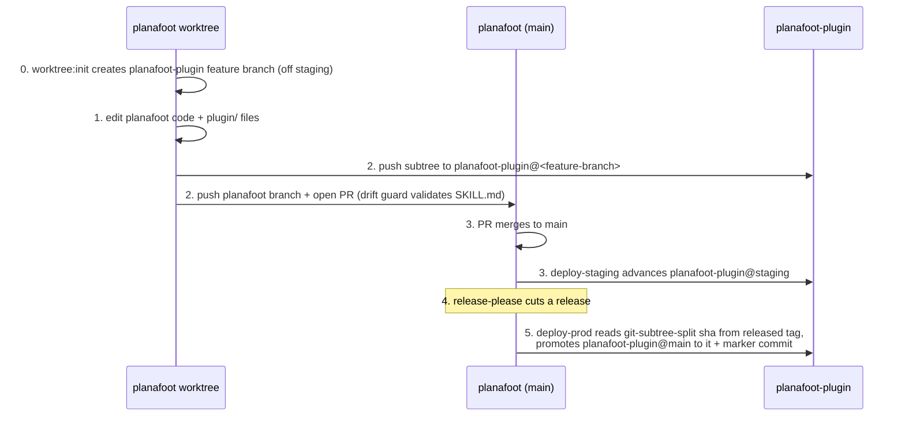

# planafoot-plugin: subtree sync + multi-agent (Gemini) design

Date: 2026-06-18
Status: Draft for review

## Goal

`planafoot-plugin` is the canonical, publishable home for the Planafoot agent
plugin(s). Today it ships a Claude Code plugin. This design:

1. Adds **Gemini CLI** support reusing the existing skill (no content duplication).
2. Moves **both** agents to **native remote MCP** (drop the `mcp-remote` npx shim).
3. Establishes the **sync model** between `planafoot` (where the skill is edited and
   validated against the live MCP tool surface) and `planafoot-plugin` (the
   published home), using a **squashed `git subtree`** so the plugin files live as
   plain vendored files in `planafoot` and flow out to `planafoot-plugin` on deploy.

Explicitly **out of scope** (deferred until after launch): OpenAI / Codex support.

## Repo layout (planafoot-plugin, final)

```
planafoot-plugin/
├── README.md                       # Claude + Gemini install sections
├── LICENSE
├── .claude-plugin/
│   ├── marketplace.json            # source: "./"
│   └── plugin.json
├── .mcp.json                       # Claude MCP — native remote (see below)
├── gemini-extension.json           # NEW — Gemini manifest
└── skills/
    └── planafoot/SKILL.md          # SHARED by both agents; drift-guarded in planafoot
```

Per-agent support is additive: each agent gets a thin manifest at the repo root
(`.claude-plugin/`, `gemini-extension.json`, later `.codex-plugin/` …), all pointing
at the one shared `skills/` tree. This matches the obra/superpowers and
antonbabenko/agent-plugins conventions: shared skills, per-agent manifest dotfiles —
not per-agent content subdirectories.

## Native remote MCP (both agents)

The Planafoot endpoint (`https://planafoot.com/mcp`) is a server-based MCP with OAuth
(Google sign-in). `mcp-remote` was only ever a stdio↔remote bridge for clients that
couldn't speak remote MCP. Both clients now support native remote MCP with OAuth, so
the shim is dropped.

**Claude (`.mcp.json`):**
```json
{
  "mcpServers": {
    "planafoot": {
      "type": "http",
      "url": "https://planafoot.com/mcp"
    }
  }
}
```

**Gemini (`gemini-extension.json`):**
```json
{
  "name": "planafoot",
  "version": "0.1.0",
  "mcpServers": {
    "planafoot": {
      "httpUrl": "https://planafoot.com/mcp"
    }
  }
}
```

Gemini auto-discovers the OAuth endpoints, opens the browser on first tool call, and
caches tokens in `~/.gemini/mcp-oauth-tokens.json`. No `GEMINI.md` — the skill loads
on demand (always-on context would bloat every session), matching how the Claude
plugin relies on `SKILL.md` rather than always-on context.

## Source-of-truth & sync model

**Where editing happens:** the skill is edited in `planafoot`, because that is the
only place the drift guard (`src/lib/server/mcp/doc-drift.spec.ts`) can validate
`SKILL.md` against the live 35-tool surface defined in `planafoot/src/lib/server/mcp/`.

**How the files live in planafoot:** as a **squashed `git subtree`** at `plugin/`.
The files are real, vendored files in planafoot's tree — so a normal (shallow,
credential-free) checkout has them, and the drift guard reads
`plugin/skills/planafoot/SKILL.md` directly. No submodule, no checkout step, no fetch
credentials needed for CI to run the guard.

**The embedded SHA:** because the subtree is squashed, each sync commit in planafoot's
history carries the source pointer in its message:

```
git-subtree-dir: plugin
git-subtree-split: <planafoot-plugin commit sha>
```

So "which planafoot-plugin commit does this planafoot commit correspond to" is
recoverable **locally** from planafoot's own history —
`git log --grep="git-subtree-dir: plugin"` → read the latest `git-subtree-split:`.
No remote query, no mapping table, no re-split.

### Branch topology in planafoot-plugin

- `staging` — tracks planafoot `main` (every push to main).
- `main` — the last **released** plugin state; what end users install.
- per-worktree feature branches — landing places for in-flight changes (named after
  the planafoot worktree branch).

### Flow



**deploy-staging** (`on: push → main`): advance `planafoot-plugin@staging` to the
plugin state of planafoot `main`. Mechanism chosen at implementation time between:
(a) re-split main and push (symmetric with prod, simplest), or (b) merge the
per-worktree planafoot-plugin feature branch (preserves hand-written commit messages
in the published history). Default: **(b)** to keep a readable published history,
falling back to (a) if branch bookkeeping proves fragile.

**deploy-prod** (`on: release: published`): the job already checks out the release
tag to build the Cloudflare worker. Add `fetch-depth: 0`, read
`git-subtree-split` from the released history, and promote `planafoot-plugin@main` to
that SHA, then add a `chore: release vX.Y.Z` marker commit. Because the released tag
is an ancestor of main, its recorded plugin SHA is an ancestor of `staging` → the push
to `main` fast-forwards.

## Credentials

Reuse the **mindlace-make-releases** GitHub App — already wired into
`release-please.yml` via `vars.RELEASE_PLEASE_APP_ID` +
`secrets.RELEASE_PLEASE_APP_PRIVATE_KEY` through `actions/create-github-app-token`,
and it already has read/write on `planafoot-plugin`. The staging and prod deploy
workflows mint a token the same way to push to `planafoot-plugin`. No new secrets.

## Distribution / visibility

`planafoot-plugin` is currently **private**. CI does not need it public (subtree
vendors the files into planafoot; only the outbound push needs the token, which it
has). End-user installation (`/plugin marketplace add mindlace/planafoot-plugin`,
`gemini extensions install …`) **does** require it to be public — a deliberate flip
"as soon as we want," tracked as a launch step, not part of this work.

## Bootstrap / migration sequence

Each step is its own worktree + PR.

1. **planafoot-plugin — reach final content** (this repo):
   - Add `gemini-extension.json` (native `httpUrl`).
   - Modernize `.mcp.json` to native `type: http` / `url`.
   - Update `README.md` (Claude + Gemini install; drop `mcp-remote` mentions).
   - Create the `staging` branch.
2. **planafoot — adopt the subtree + wire deploys**:
   - Replace the existing plain `plugin/` directory with a squashed subtree of
     `planafoot-plugin` (`git rm -r plugin` → `git subtree add --prefix=plugin
     --squash <planafoot-plugin> main`). Net new files under `plugin/`:
     `gemini-extension.json`, `LICENSE`. Drift-guard path unchanged.
   - Extend `worktree:init` to create/checkout the matching planafoot-plugin feature
     branch (off `staging`).
   - Add the subtree push/promote steps to `deploy-staging.yml` and
     `deploy-prod.yml`, authenticated via the mindlace-make-releases token.
   - Decide prettier/eslint ownership of `plugin/`: `SKILL.md` stays prettier-checked
     in planafoot (the drift remediation already runs
     `prettier --check plugin/skills/planafoot/SKILL.md`), so planafoot-plugin must
     carry a matching prettier config; the rest of `plugin/` is ignored by planafoot's
     formatters to avoid ping-pong.

## Drift guard interaction

`doc-drift.spec.ts:88` reads `plugin/skills/planafoot/SKILL.md`. With the squashed
subtree those are plain in-tree files, so the guard runs unchanged on a normal
checkout. The skill is edited in planafoot, validated by the guard, then flows out —
keeping the published skill always in sync with the live tool surface.

## Open items to validate in the plan (with real git runs)

- Exact subtree command choreography that keeps the `git-subtree-split` trailer
  accurate for outbound edits (`subtree push` vs `split --rejoin` vs `pull --squash`).
  Subtree's `add`/`pull`/`push`/`split`/`--squash`/`--rejoin` interactions are finicky
  and must be verified empirically, not assumed.
- Fast-forward discipline: feature branches off `staging` so staging→main promotions
  stay linear; confirm the first promotion after bootstrap fast-forwards.
- `git worktree` + subtree ergonomics under `worktree:init`.
- Gitlink-free reachability: ensure a planafoot-plugin feature branch's commit is
  reachable (merged to `staging`) before the branch is deleted.

## Out of scope

- OpenAI / Codex plugin (deferred until after launch).
- Making `planafoot-plugin` public (separate launch step).
